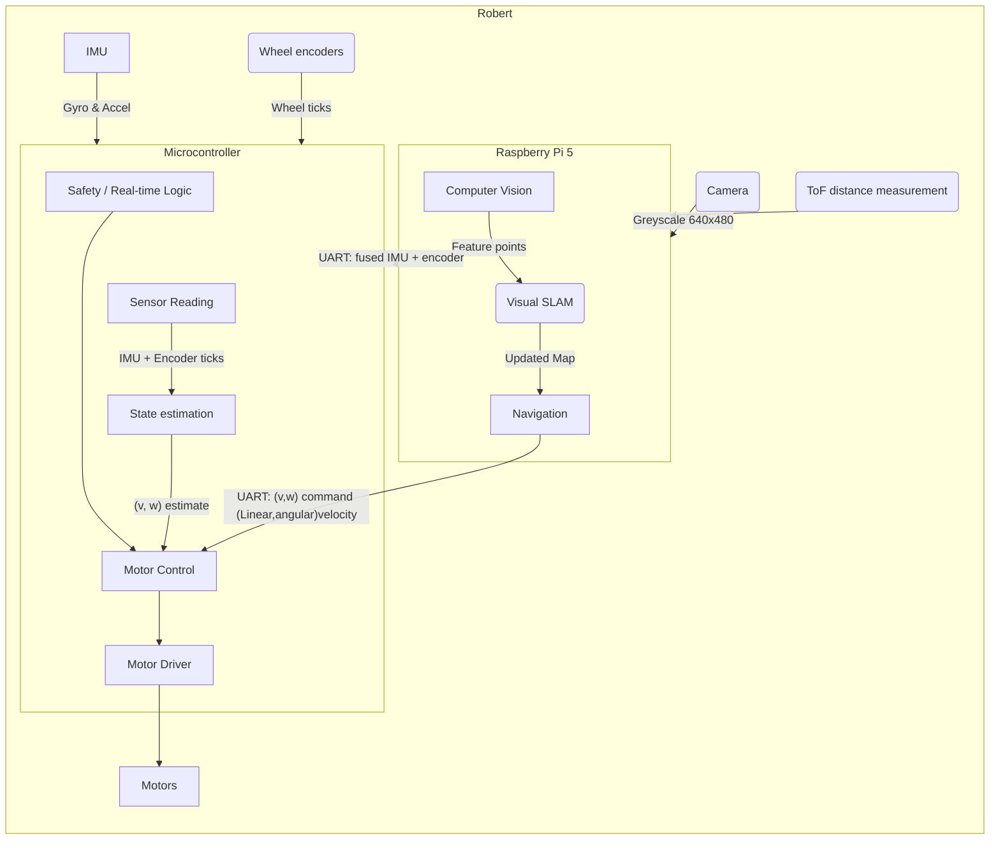
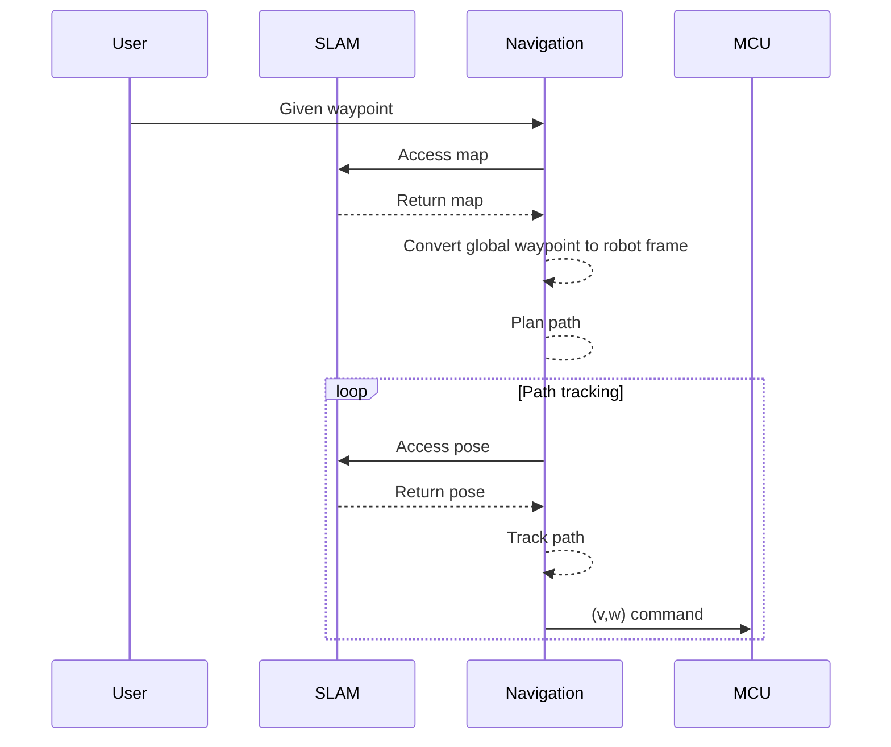
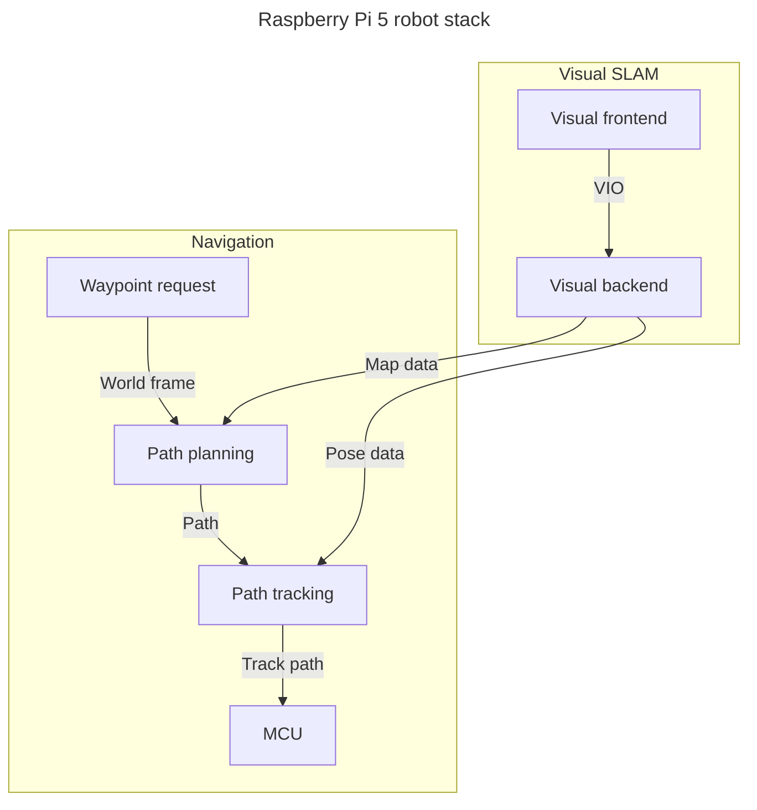
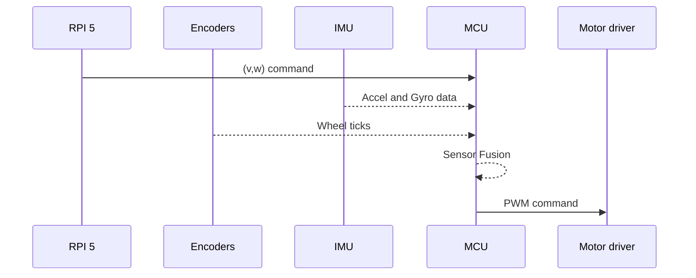

# 2D Robot Robert
Robert is a 2D differential-drive robot using a Raspberry pi 5 as a main compute and a Raspberry pi Pico 2W as a low level/real-time controller.

## Motivation 
I started this project after having participated in the course [DD2419](https://www.kth.se/student/kurser/kurs/DD2419?l=en) at KTH and had a lot of fun so I wanted to make my own and do it all myself. In the future I would like to move to more advanced robotics platforms. 

## Goals
The goal of Robert is not only to build a working robot, but to implement the major robotics components myself and use the project to explore:

- Embedded systems
- Real-time control
- State estimation and sensor fusion
- Computer vision
- Visual-inertial SLAM
- Path planning and tracking
- Robot kinematics and dynamics

# Why not ROS 2?
Robert is intentionally being developed without relying on ROS 2 implementations of the core robotics algorithms. The goal is to implement the underlying systems myself rather than primarily integrating existing robotics frameworks. ROS 2 will be used as a communication and integration layer between modules, while keeping the individual components as independent as possible.

## Hardware
Compute
- **Main compute:** [ Raspberry Pi 5 16GB](https://www.raspberrypi.com/products/raspberry-pi-5/)
- **MCU:**  [Raspberry Pi Pico 2W](https://www.raspberrypi.com/products/raspberry-pi-pico-2/)

Sensors
- **Camera** [Raspberry Pi camera module 3](https://www.raspberrypi.com/products/camera-module-3/) 
- **IMU:** [LSM6DSO](https://www.st.com/en/mems-and-sensors/lsm6dso.html)
- **ToF:** [VL53L4CD](https://www.st.com/en/imaging-and-photonics-solutions/vl53l4cd.html)
- **Encoder:** [Pololu magnetic encoders](https://www.pololu.com/product/4760)

Actuation
- **Motor driver:** [BBL298](https://www.olimex.com/Products/Robot-CNC-Parts/MotorDrivers/BB-L298/open-source-hardware)
- **Motor:**  [2× [Micro Metal Gearmotor 75:1, 6 V, 1.5 A stall current (\#3064)]](https://www.pololu.com/product/3064)

Mechanical
- **Wheels:** [Pololu 80mm diameter](https://www.pololu.com/product/1431)
- **Chassis** 2× [Olimex plates stacked](https://www.olimex.com/Products/Robot-CNC-Parts/Chassis/ROBOT-CHASSIS-3/)

## Progress

| Component | Status |
|------|-------------|
| Hardware | In progress |
| MCU firmware | In progress | 
| Sensor reading | In progress |
| Sensor fusion | Not implemented |
| Motor control | In progress |
| Path planning | Implemented |
| Path tracking | Not implemented |
| Visual SLAM | Not implemented |
| Computer Vision | Not implemented |

For more information regarding the MCU/low level side of this project visit the link below:

[Robert MCU github page](https://github.com/carmor1337/Robert_pico_firmware)

## System Architecture

The high-level navigation stack commands the robot using linear velocity v and angular velocity ω. The MCU converts these commands into individual wheel velocity targets and ultimately motor PWM commands.

The IMU and wheel encoders are connected directly to the MCU because they are used for real-time state estimation and control. The ToF sensor is connected to the Pi because it is primarily used for obstacle detection/navigation and solving the absolute distance problem of monocular vision and does not require the same timing guarantees.

## Software diagram

    

Robert overview 

RPI 5 Overview

## MCU diagram

MCU Overview

