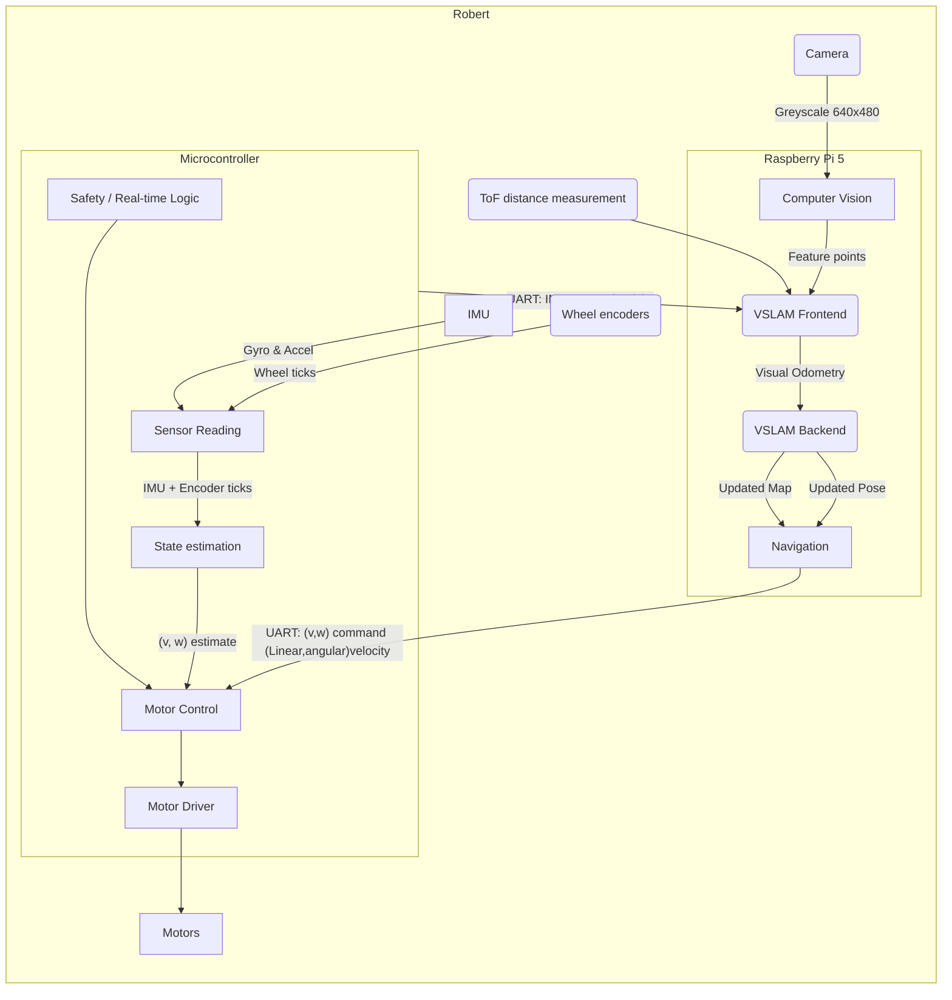
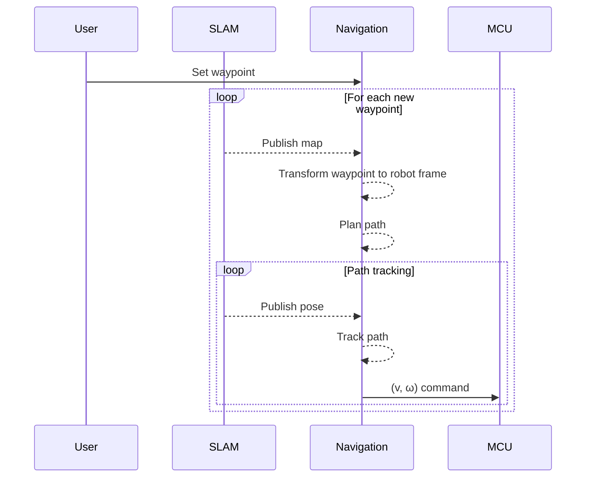
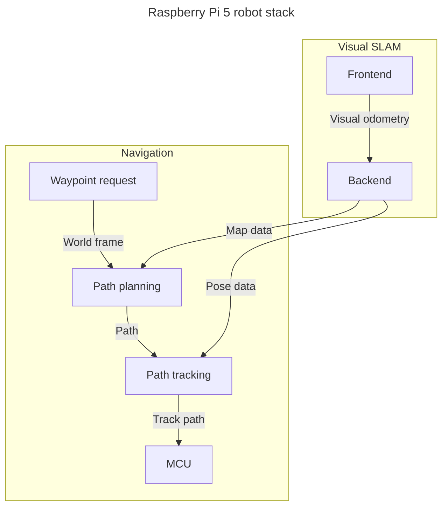
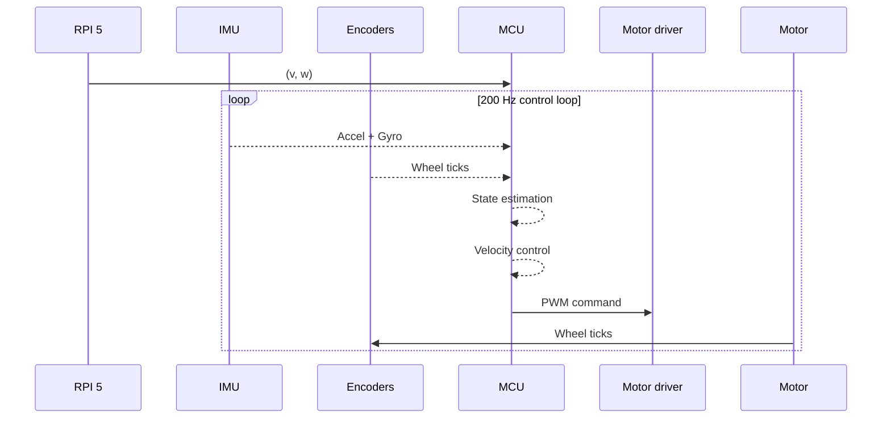

# Robert - Differential drive robot  
Robert is a 2D differential-drive robot built around a Raspberry Pi 5 and Raspberry Pi Pico 2 W. The Pi 5 handles high-level perception, localization, and navigation, while the Pico 2 W handles low-level real-time control and safety.

- [Motivation](#motivation)
- [Goals](#goals)
- [Why not ROS 2?](#why-not-ros-2)
- [Hardware](#hardware)
- [Progress](#progress)
- [System Architecture](#system-architecture)
- [Software diagrams](#software-diagrams)
- [MCU diagram](#mcu-diagram)

## Motivation 
I started this project after having participated in the course [DD2419](https://www.kth.se/student/kurser/kurs/DD2419?l=en) at KTH and had a lot of fun so I wanted to make my own and do it all myself. In the future I would like to move to more advanced robotics platforms. 

## Goals
The goal of Robert is not only to build a working robot, but also to implement the major robotics components myself and use the project to explore:

- Embedded systems
- Real-time control
- State estimation
- Computer vision
- Visual-inertial SLAM
- Path planning and tracking
- Robot kinematics and dynamics

# Why not ROS 2?
Robert is intentionally being developed without relying on ROS 2 implementations of the core robotics algorithms. The goal is to implement the underlying systems myself rather than primarily integrating existing robotics frameworks. ROS 2 will be used as a communication and integration layer between modules, while keeping the individual components as independent as possible.

## Hardware
### Compute
- **Main compute:** [ Raspberry Pi 5 16GB](https://www.raspberrypi.com/products/raspberry-pi-5/)
- **MCU:**  [Raspberry Pi Pico 2 W](https://www.raspberrypi.com/products/raspberry-pi-pico-2/)

### Sensors
- **Camera:** [Raspberry Pi camera module 3](https://www.raspberrypi.com/products/camera-module-3/) 
- **IMU:** [LSM6DSO](https://www.st.com/en/mems-and-sensors/lsm6dso.html)
- **ToF:** [VL53L4CD](https://www.st.com/en/imaging-and-photonics-solutions/vl53l4cd.html)
- **Encoder:** [Pololu magnetic encoders](https://www.pololu.com/product/4760)

### Actuation
- **Motor driver:** [BBL298](https://www.olimex.com/Products/Robot-CNC-Parts/MotorDrivers/BB-L298/open-source-hardware)
- **Motors:**  [2× Micro Metal Gearmotor 75:1, 6 V, 1.5 A stall current (#3064)](https://www.pololu.com/product/3064)

### Mechanical
- **Wheels:** [Pololu 80 mm diameter](https://www.pololu.com/product/1431)
- **Chassis** [2× Olimex plates stacked](https://www.olimex.com/Products/Robot-CNC-Parts/Chassis/ROBOT-CHASSIS-3/)

## Progress

### V1 algorithm stack

**Current status:** The hardware and low-level control stack are under development. Path planning and computer vision components are implemented, while state estimation, path tracking, and visual-inertial SLAM are still in development.

| Part  | Algorithm | Status
|------|-------------|-------------|
| Path planning | A* / D* Lite | Implemented
| Path tracking | Pure Pursuit | Not implemented
| Velocity control | Cascaded PID controllers | In progress
| Pi–MCU communication | UART | Not implemented
| Feature extractor | ORB | Implemented
| Visual odometry | TBD | Not implemented
| Backend | EKF | In progress
| Loop closure | Planned | -
| Visual-inertial SLAM | Custom implementation | In progress

For more information regarding the MCU/low level side of this project visit the link below:

[Robert MCU github page](https://github.com/carmor1337/Robert_pico_firmware)

## System Architecture

The high-level navigation stack commands the robot using linear velocity v and angular velocity ω. The MCU converts these commands into individual wheel velocity targets and ultimately motor PWM commands.

The ToF sensor is connected to the Pi because it is primarily used for obstacle detection and navigation, providing metric depth information that is difficult to obtain from monocular vision alone and does not require the same timing guarantees.

## Software diagrams

    

Robert overview 

RPI 5 Overview

## MCU diagram

MCU Overview

