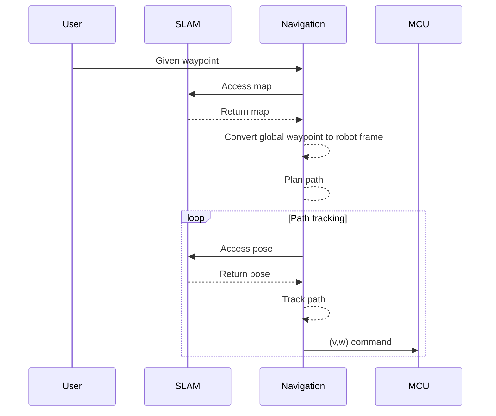
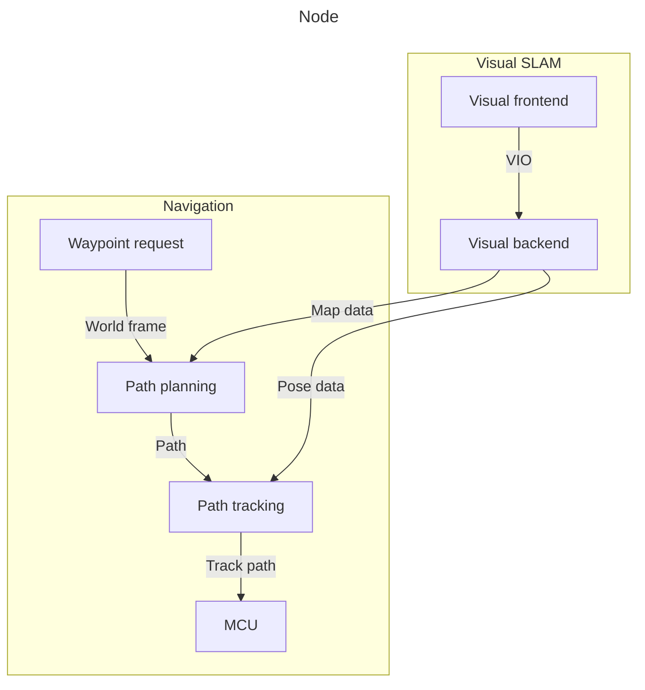
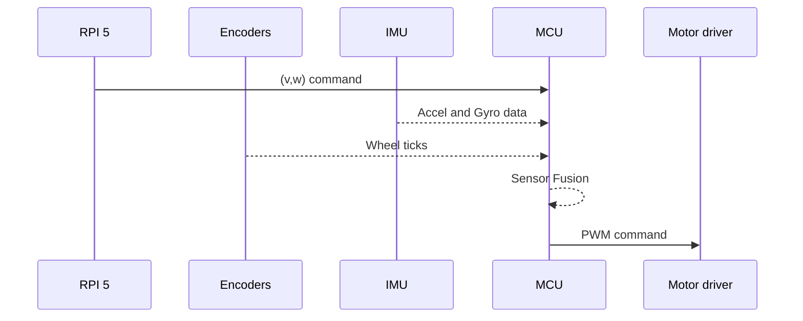

# 2D Robot Robert
Robert is a 2D differential-drive robot using a Raspberry pi 5 as a main compute and a Raspberry pi Pico 2W as a low level/real-time controller.

## System Architecture

## Motivation 
I started this project after having participated in the course [DD2419](https://www.kth.se/student/kurser/kurs/DD2419?l=en) at KTH and had a lot of fun so I wanted to make my own and do it all myself. In the future I would like to move to more advanced robotics platforms. 

## Goals
The goal of Robert is not only to build a working robot, but to implement the major robotics components myself and use the project to explore:

-Embedded systems
-Real-time control
-State estimation and sensor fusion
-Computer vision
-Visual-inertial SLAM
-Path planning and tracking
-Robot kinematics and dynamics

# Relationship with ROS 2
Robert is intentionally being developed without ROS for the core robotics stack. The goal of the project is to understand and implement the underlying systems myself rather than primarily integrating existing robotics frameworks. ROS will be used for intra-robot modules and communication but I will try to modulazie it as much as possible to make ROS as a communications layer.

## Hardware
Compute
- **Main compute:** [ Raspberry Pi 5 16GB](https://www.raspberrypi.com/products/raspberry-pi-5/)
- **MCU:**  [Raspberry Pi Pico 2W](https://www.raspberrypi.com/products/raspberry-pi-pico-2/)

Sensors
- **Camera** [Raspberry Pi camera module 3](https://www.raspberrypi.com/products/camera-module-3/) 
- **IMU:** [LSM6DSO](https://www.st.com/en/mems-and-sensors/lsm6dso.html)
- **ToF:** [VL53L4CD](https://www.st.com/en/imaging-and-photonics-solutions/vl53l4cd.html)
- **Encoder:** [Pololu magnetic encoders](https://www.pololu.com/product/4760)

Actuation
- **Motor driver:** [BBL298](https://www.olimex.com/Products/Robot-CNC-Parts/MotorDrivers/BB-L298/open-source-hardware)
- **Motor:**  [2 micro motors 75:1, 6V, 1.5A stall current, \#3064](https://www.pololu.com/product/3064)
- 
Mechanical
- **Wheels:** [Pololu 80mm diameter](https://www.pololu.com/product/1431)
- **Chassis** 2 [Olimex plates stacked](https://www.olimex.com/Products/Robot-CNC-Parts/Chassiss/ROBOT-3-WHEEL-KIT/)

## Progress

| Component | Status |
|------|-------------|
| Hardware | In progress |
| MCU firmware | In progress | 
| Sensor reading | In progress |
| Sensor fusion | Not implemented |
| Motor control | In progress |
| Path planning | Implemented |
| Path tracking | Not implemented |
| Visual SLAM | Not implemented |
| Computer Vision | Not implemented |

 MCU Tasks and progress 

| Motor control | Status |
|------|-------------|
| Hardware | In progress |

| Sensor fusion | Status |
|------|-------------|
| Hardware | In progress |

| Drivers | Status |
|------|-------------|
| Hardware | In progress |

| RPI 5 comms | Status |
|------|-------------|
| Hardware | In progress |

## Software diagram

    

Robert overview 

RPI 5 Overview

## MCU diagram

MCU Overview

