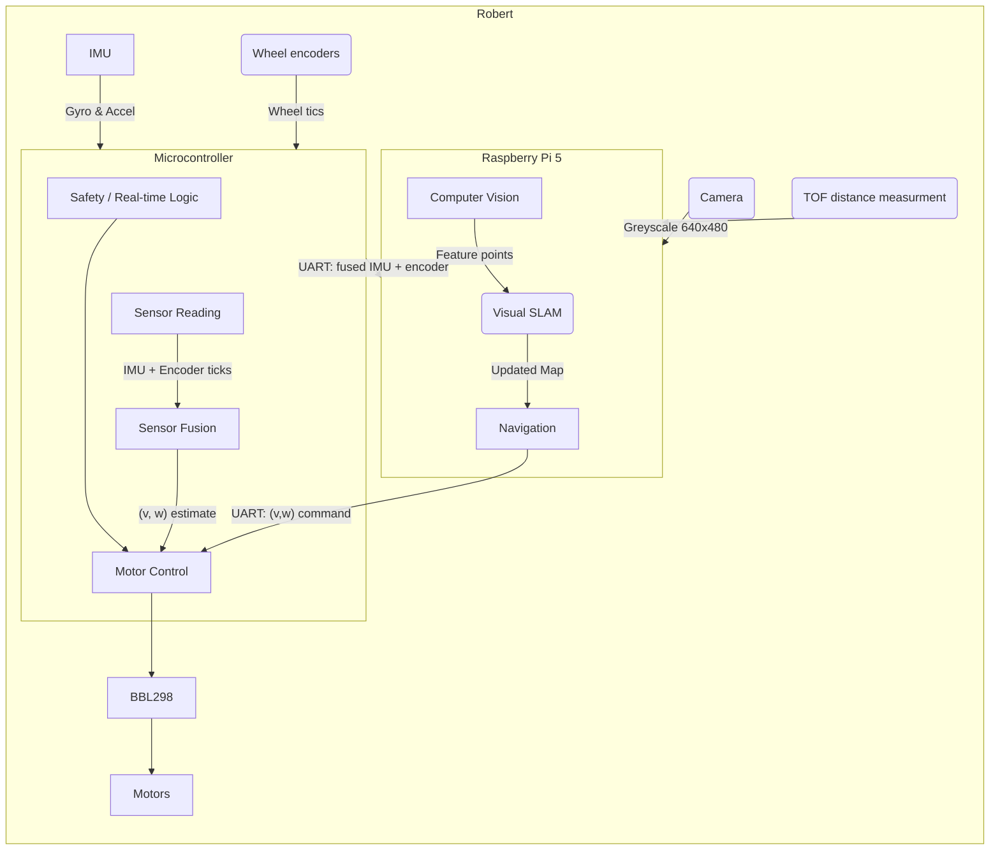
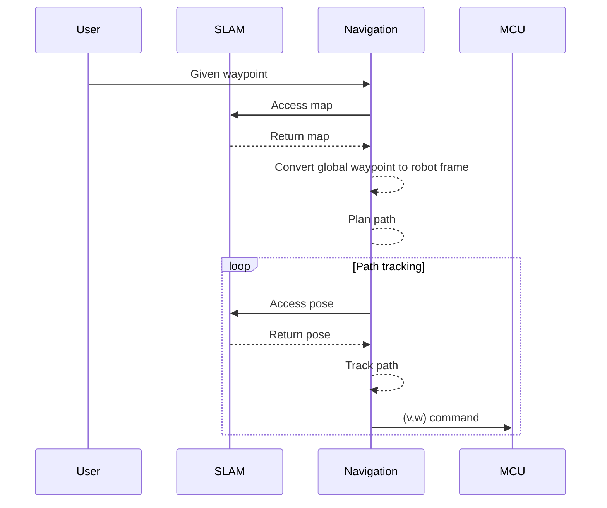
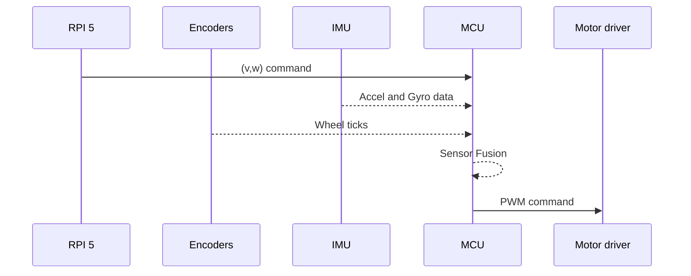

# 2D Robot Robert
My personal project on a 2D robot for fun

## What

## Why 

## Hardware
TODO add links to the products
- **Main compute:** [ Raspberry Pi 5 16GB](https://www.raspberrypi.com/products/raspberry-pi-5/)
- **Camera** [Raspberry Pi camera module 3](https://www.raspberrypi.com/products/camera-module-3/) 
- **MCU:**  [Raspberry Pi Pico 2W](https://www.raspberrypi.com/products/raspberry-pi-pico-2/)
- **IMU:** [LSM6DSO](https://www.st.com/en/mems-and-sensors/lsm6dso.html)
- **TOF:** [VL53L4CD](https://www.st.com/en/imaging-and-photonics-solutions/vl53l4cd.html)
- **Encoder:** [Pololu magnetic encoders]()
- **Motor driver:** [BBL298](https://www.olimex.com/Products/Robot-CNC-Parts/MotorDrivers/BB-L298/open-source-hardware)
- **Motor:**  [2 Micro motors 75:1, 6V, 1.5A stall current, \#3064](https://www.pololu.com/product/3064)
- **Wheels:** [Pololu 80mm diameter](https://www.pololu.com/product/1431)
- **Chassi** 2 [Olimex plates stacked](https://www.olimex.com/Products/Robot-CNC-Parts/Chassis/ROBOT-3-WHEEL-KIT/)

## Progress

| Robert feature | Status |
|------|-------------|
| SLAM | To be implemented |
| Path planning | Algorithm done | 
| Path tracking| To be implemented |
| MCU | Under construction  |

## Diagrams

Robert overview 

RPI 5 Overview

MCU Overview

Some explanatory text can go here too.

